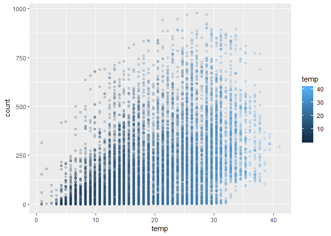
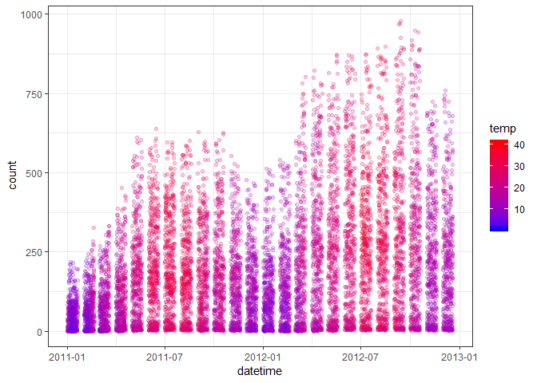
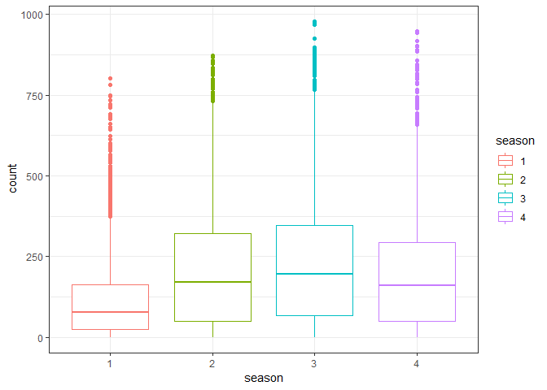
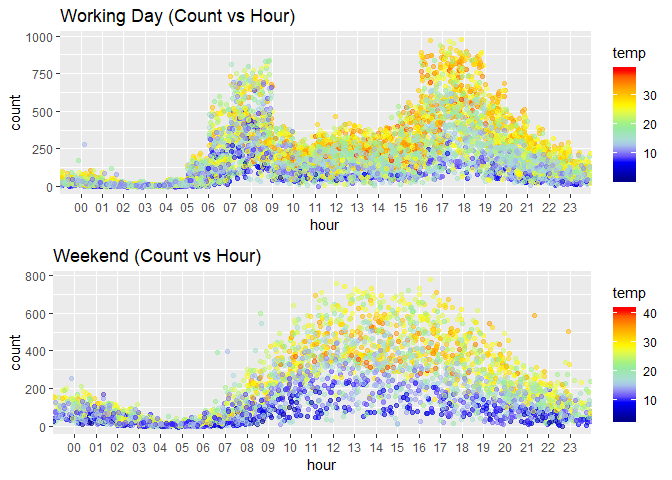
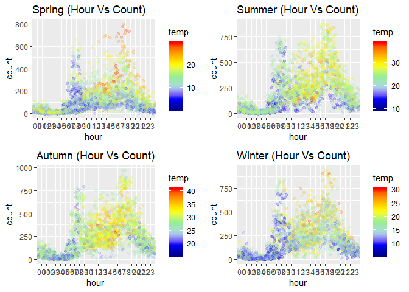
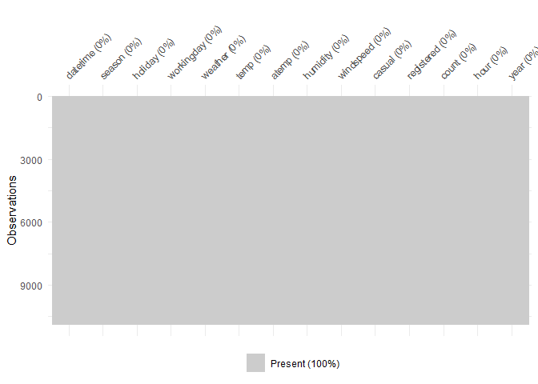
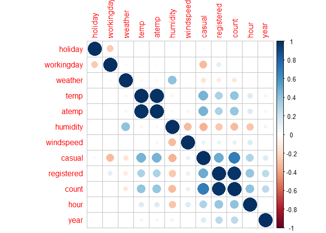
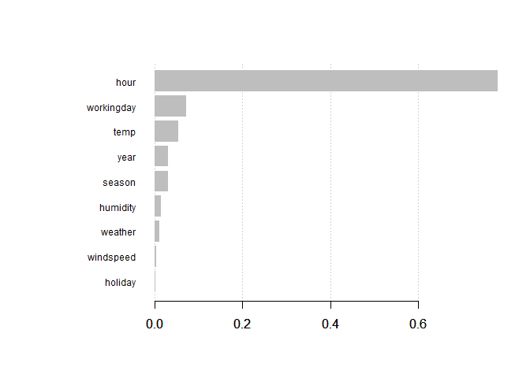

Predict Bike Sharing Trends
================
Written By: Javier

Introduction
------------

Predict the total count of bikes rented during each hour on the 20th day

Loading of Data set
-------------------

``` r
#load data
train <- read.csv("train.csv", stringsAsFactors = F)
test <- read.csv("test.csv", stringsAsFactors = F)
```

Formatting Date/Time
--------------------

``` r
train$datetime <- as.POSIXct(train$datetime, format="%Y-%m-%d %H:%M:%S")
str(train) #check out the structure of dataset
```

    ## 'data.frame':    10886 obs. of  12 variables:
    ##  $ datetime  : POSIXct, format: "2011-01-01 00:00:00" "2011-01-01 01:00:00" ...
    ##  $ season    : int  1 1 1 1 1 1 1 1 1 1 ...
    ##  $ holiday   : int  0 0 0 0 0 0 0 0 0 0 ...
    ##  $ workingday: int  0 0 0 0 0 0 0 0 0 0 ...
    ##  $ weather   : int  1 1 1 1 1 2 1 1 1 1 ...
    ##  $ temp      : num  9.84 9.02 9.02 9.84 9.84 ...
    ##  $ atemp     : num  14.4 13.6 13.6 14.4 14.4 ...
    ##  $ humidity  : int  81 80 80 75 75 75 80 86 75 76 ...
    ##  $ windspeed : num  0 0 0 0 0 ...
    ##  $ casual    : int  3 8 5 3 0 0 2 1 1 8 ...
    ##  $ registered: int  13 32 27 10 1 1 0 2 7 6 ...
    ##  $ count     : int  16 40 32 13 1 1 2 3 8 14 ...

Exploratory Data Analysis
-------------------------

``` r
library(ggplot2)
library(gridExtra)
```

``` r
ggplot(train, aes(x=temp, y=count)) + geom_point(aes(colour=temp), alpha=0.2) #shows that rental increases as temp increases
```



``` r
ggplot(train,aes(datetime,count)) + 
  geom_point(aes(color=temp),alpha=0.2) +  #shows seasonality of data
  scale_color_gradient(high='red',low='blue') + 
  theme_bw()
```



``` r
train$season <- as.factor(train$season)

ggplot(train, aes(season, count)) + geom_boxplot(aes(colour=season)) + theme_bw() #more rentals during winter vs spring
```



``` r
train$hour <- sapply(train$datetime, function(x) format(x,"%H"))
train$year <- sapply(train$datetime, function(x) format(x, "%Y"))

workingdayplot <- ggplot(subset(train, workingday == 1), aes(hour, count)) + 
  geom_point(aes(colour=temp), alpha=0.5, position=position_jitter(w=1, h=5)) +
  scale_color_gradientn(colors=c('dark blue','blue','light blue','light green','yellow','orange','red')) +
  ggtitle("Working Day (Count vs Hour)")#general trend - Working Day

weekendplot <- ggplot(subset(train, workingday == 0), aes(hour, count)) + 
  geom_point(aes(colour=temp), alpha=0.5, position=position_jitter(w=1, h=5)) +
  scale_color_gradientn(colors=c('dark blue','blue','light blue','light green','yellow','orange','red')) +
  ggtitle("Weekend (Count vs Hour)")#general trend - Weekend Day

grid.arrange(workingdayplot, weekendplot, nrow=2) #comparing between working day vs weekend
```



``` r
spring <- ggplot(subset(train, season == "1"), aes(hour, count)) + 
  geom_point(aes(colour=temp), alpha=0.2, position=position_jitter(w=1, h=5)) + 
  scale_color_gradientn(colors=c('dark blue','blue','light blue','light green','yellow','orange','red'))+
  ggtitle("Spring (Hour Vs Count)")

summer <- ggplot(subset(train, season == "2"), aes(hour, count)) + 
  geom_point(aes(colour=temp), alpha=0.2, position=position_jitter(w=1, h=5)) + 
  scale_color_gradientn(colors=c('dark blue','blue','light blue','light green','yellow','orange','red'))+
  ggtitle("Summer (Hour Vs Count)")

autumn <- ggplot(subset(train, season == "3"), aes(hour, count)) + 
  geom_point(aes(colour=temp), alpha=0.2, position=position_jitter(w=1, h=5)) + 
  scale_color_gradientn(colors=c('dark blue','blue','light blue','light green','yellow','orange','red'))+
  ggtitle("Autumn (Hour Vs Count)")

winter <- ggplot(subset(train, season == "4"), aes(hour, count)) + 
  geom_point(aes(colour=temp), alpha=0.2, position=position_jitter(w=1, h=5)) + 
  scale_color_gradientn(colors=c('dark blue','blue','light blue','light green','yellow','orange','red'))+
  ggtitle("Winter (Hour Vs Count)")

grid.arrange(spring, summer, autumn, winter, ncol=2) #show rental per hour during 4 seasons
```



Data transformation & Model preparation
---------------------------------------

``` r
train$hour = sapply(train$hour, as.numeric)
train$year = sapply(train$year, as.numeric)

library(naniar)
```

    ## Warning: package 'naniar' was built under R version 3.4.4

``` r
vis_miss(train) #checking for missing values
```

    ## Warning: package 'bindrcpp' was built under R version 3.4.4



Identifying Correlated Features
-------------------------------

``` r
library(corrplot) 
library(dplyr)
```

``` r
cors <- cor(train[ , sapply(train, is.numeric)]) #shows a correlation matrix
high_cor <- which(abs(cors) > 0.6 & (abs(cors) < 1)) #identify the positions of high correlation features, counting from col down!
rows <- rownames(cors)[((high_cor-1) %/% 12)+1] # %/% = integer division i.e. 5 %/% 2 = 2/ 12 BECAUSE it has 12 col & rows!
cols <- colnames(cors)[ifelse(high_cor %% 12 == 0, 12, high_cor %% 12)] #modulus (x mod y) 5%%2 = 1 
vals <- cors[high_cor]

cor_data = data.frame(cols=cols, rows=rows, correlation=vals)
cor_data #as atemp and temp, count - casual and registered are high predictors, they will be removed
```

    ##         cols       rows correlation
    ## 1      atemp       temp   0.9849481
    ## 2       temp      atemp   0.9849481
    ## 3      count     casual   0.6904136
    ## 4      count registered   0.9709481
    ## 5     casual      count   0.6904136
    ## 6 registered      count   0.9709481

As atemp, temp, count - registered are high predictors, they will be removed.

``` r
corrplot(cors) #visualize correlation
```



``` r
train <- select(train, -c(atemp, registered, casual, datetime)) #datetime is removed because year and hour already inside
```

Model Selection
---------------

### Multiple Linear Regression

``` r
model <- lm(count ~., data = train)

#using stepwise algorithm to find the best model based on lowest AIC

model <- step(model)
```

    ## Start:  AIC=107784.9
    ## count ~ season + holiday + workingday + weather + temp + humidity + 
    ##     windspeed + hour + year
    ## 
    ##              Df Sum of Sq       RSS    AIC
    ## - workingday  1      3461 216757191 107783
    ## - holiday     1     36458 216790189 107785
    ## <none>                    216753731 107785
    ## - windspeed   1     77226 216830957 107787
    ## - weather     1    176479 216930209 107792
    ## - season      3   8350262 225103992 108190
    ## - humidity    1   9108243 225861974 108231
    ## - temp        1  15501405 232255135 108535
    ## - year        1  17660377 234414107 108636
    ## - hour        1  26521412 243275143 109040
    ## 
    ## Step:  AIC=107783.1
    ## count ~ season + holiday + weather + temp + humidity + windspeed + 
    ##     hour + year
    ## 
    ##             Df Sum of Sq       RSS    AIC
    ## - holiday    1     33128 216790319 107783
    ## <none>                   216757191 107783
    ## - windspeed  1     77007 216834198 107785
    ## - weather    1    178636 216935827 107790
    ## - season     3   8347686 225104878 108188
    ## - humidity   1   9104884 225862075 108229
    ## - temp       1  15513699 232270891 108534
    ## - year       1  17663679 234420870 108634
    ## - hour       1  26535113 243292304 109038
    ## 
    ## Step:  AIC=107782.8
    ## count ~ season + weather + temp + humidity + windspeed + hour + 
    ##     year
    ## 
    ##             Df Sum of Sq       RSS    AIC
    ## <none>                   216790319 107783
    ## - windspeed  1     75533 216865852 107785
    ## - weather    1    177437 216967756 107790
    ## - season     3   8337673 225127992 108188
    ## - humidity   1   9108889 225899209 108229
    ## - temp       1  15526033 232316353 108534
    ## - year       1  17646450 234436770 108633
    ## - hour       1  26534218 243324538 109038

#### Model Validation with Testing Data

``` r
test$datetime <- as.POSIXct(test$datetime, format="%Y-%m-%d %H:%M:%S")
test$hour <- sapply(test$datetime, function(x) format(x,"%H"))
test$year <- sapply(test$datetime, function(x) format(x, "%Y"))
test$season <- as.factor(test$season)

for (i in 1:ncol(test)){
  if (typeof(test[,i]) == "character") {
    test[i] <- as.numeric(test[,i])
  }
}

value1 <- predict(model, newdata=test)
results <- data.frame(datetime = test$datetime, count=value1) #got the predicted values; however need to refer to the log one for accuracy!
head(results)
```

    ##              datetime      count
    ## 1 2011-01-20 00:00:00 -21.892843
    ## 2 2011-01-20 01:00:00 -23.279903
    ## 3 2011-01-20 02:00:00 -15.641859
    ## 4 2011-01-20 03:00:00  -4.185414
    ## 5 2011-01-20 04:00:00   3.452629
    ## 6 2011-01-20 05:00:00  -1.884159

### SV Regression

``` r
library(e1071)
```

``` r
# Fitting SVR to the dataset
modelsvr <- svm(formula = count ~ .,
                data = train,
                type = 'eps-regression',
                kernel = 'radial')

# Predicting a new result
values2 <- predict(modelsvr, test)
head(values2)
```

    ##          1          2          3          4          5          6 
    ## 25.5604864  2.1179905  0.3561879  3.0528678  7.0328829 22.0841591

### Random Forest

``` r
library(randomForest)
```

``` r
# Fitting Random Forest Regression to the dataset
set.seed(743)
modelRF <- randomForest(x = train[,-which(names(train)=="count")],
                         y = train$count)

# Predicting a new result with Random Forest Regression
values3 <- predict(modelRF, test)
head(values3)
```

    ##         1         2         3         4         5         6 
    ## 13.640076  7.902131  5.938653  4.578260  4.291358  6.219638

### XGBoost

``` r
library(xgboost)
```

#### Making count linear by log

``` r
train$count <- log1p(train$count) #count transformation
train$season <- as.numeric(train$season)
```

``` r
#### Model Development
x_train <- as.matrix(select(train, -count))
y_train <- train$count

dtrain <- xgb.DMatrix(x_train, label = y_train)
model <- xgb.train(data = dtrain, nround = 150, max_depth = 5, eta = 0.1, subsample = 0.9) #can add in tuning matrix! 

xgb.plot.importance(xgb.importance(feature_names = colnames(x_train), model))
```



Important features are plotted

#### Model Test

``` r
test$datetime <- as.POSIXct(test$datetime, format="%Y-%m-%d %H:%M:%S")
test$hour <- sapply(test$datetime, function(x) format(x,"%H"))
test$year <- sapply(test$datetime, function(x) format(x, "%Y"))
test$season <- as.numeric(test$season)
test$hour <- as.numeric(test$hour)
test$year <- as.numeric(test$year)

x_test <- as.matrix(select(test, -c(datetime, atemp)))
y_test <- test$count
preds <- predict(model, x_test)
preds <- expm1(preds) #to get back absolute count
solution <- data.frame(datetime = test$datetime, count = preds)
head(solution)
```

    ##              datetime     count
    ## 1 2011-01-20 00:00:00 11.139785
    ## 2 2011-01-20 01:00:00  4.905254
    ## 3 2011-01-20 02:00:00  2.659188
    ## 4 2011-01-20 03:00:00  1.690217
    ## 5 2011-01-20 04:00:00  1.465907
    ## 6 2011-01-20 05:00:00  5.344030
